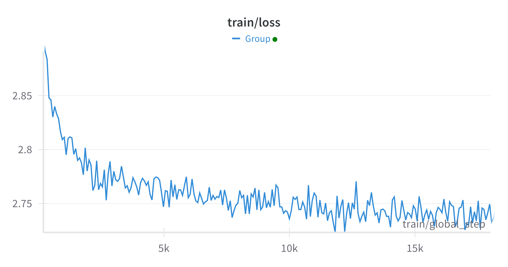

# MoE Qwen

This is a MoE model project constructed based on the Qwen model. 

> code is coming soon!

# Evaluations

**18000 steps (Continue Pretraining)**

[cpkt download](https://huggingface.co/chestnutlzj/MoE-Qwen-4x1.8B-pretrain-18000-ckpt)

|  Groups   | Metric |Value |   |Stderr|
|-----------|--------|-----:|---|-----:|
|boolq      |acc     |0.6502|±  |0.0083|
|ceval-valid|acc     |0.5171|±  |0.1872|
|           |acc_norm|0.5171|±  |0.1872|
|cmmlu      |acc     |0.5041|±  |0.1222|
|           |acc_norm|0.5041|±  |0.1222|
|mathqa     |acc     |0.2693|±  |0.0081|
|           |acc_norm|0.2693|±  |0.0081|

# Loss Plot

# Acknowledgements

+ [Qwen](https://github.com/QwenLM/Qwen)
+ [mistral.ai](https://mistral.ai)

# License Agreement

This project is open source under the Tongyi Qianwen Research License Agreement. You can view the complete license agreement in this link: [LICENSE](https://github.com/QwenLM/Qwen/blob/main/Tongyi%20Qianwen%20RESEARCH%20LICENSE%20AGREEMENT).

During the use of this project, please ensure that your usage behavior complies with the terms and conditions of the license agreement.
